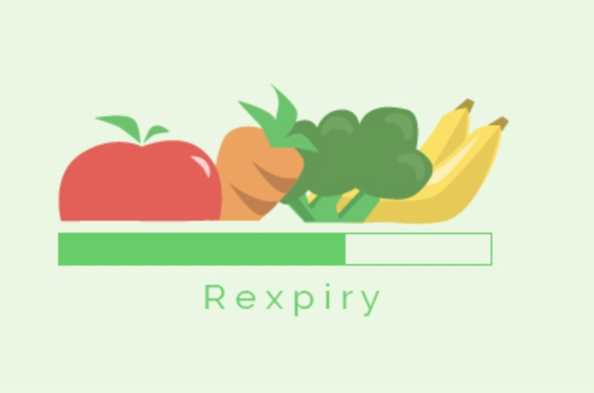

# Rexpiry

## What is Rexpiry?
It is hard to keep track of expiring food items, if only there was a way to keep track...
Rexpiry is an iOS application that scans your receipt for produce items and sets reminders that tell you when each item is expiring.

## How it Works
We used the Tesseract OCR (optical character recognition) API to scan the receipt for produce items. After scanning, the app queries our MySQL database hosted on an Apache Server through xampp to find out when each item will expire. Finally, the app sets alerts on your iPhone that remind you when a certain produce item is nearing its expiry date.

## Tech Stack
- Swift
- MySQL
- PHP
- Tesseract API
- Apache
